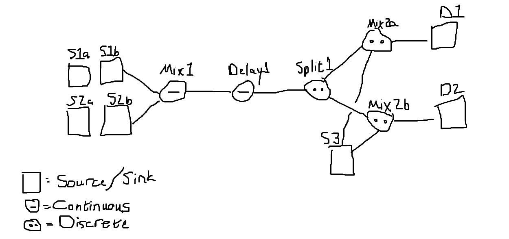

# Mini Track & Trace Analyzer
## Introduction
One of the things customers are interested in analyzing is the flow of product through the factory. This is particularly useful for being able to trace 

### Production Model Graph `ProductionNetwork`
The factory is represented as a graph where each node (`ProductionUnit`) is a production unit that performs some function in the production process. Each edge (`ProductionConnection`) represents a connection where one node could feed to another connection. The production network is static and represents the configuration of the factory. It is used to define the product flow throughout the plant.
#### Types of Production Units
There are different types of production units which will need different ways of linking input materials to output materials. They are listed below along with information about how to treat them.
1. IngredientAddition
   Represents new materials entering the system. Only has an output.
2. ProductionContinuous
   Represents a continuous production process. Each output movement will have a start date and end date indicating the start and end of product supply. The total amount of material supplied is totalized. Inputs are included after the residence time is passed.
3. ProductionBatch
   Represents a discrete production process. Each output movement has a start date and end date for when the batch started and ended.
4. FinalProductSink
   Represents completed products leaving from the system. Only has an input.

### Production Run `ProductionRun`
Each production run contains product transfer information for some period of time that the plant ran for. These are typically about a day, but do not need to be a specific lenght of time. Each product movement is defined as a `ProductMovement`, which has its own start and end date
Continuous: start, end, quantity
Batch: start, end
Edge
Material

## The Task
Given a `ProductionNetwork` and `ProductionRun` json import, for each final product in the run (the material that ended at a `FinalProductSink` node), determine which input materials ended up as a component for the final product (materials that come from an `IngredientAddition` node).

Let me know if you have any questions or clarifications.
Good luck! I look forward to seeing what you come up with!